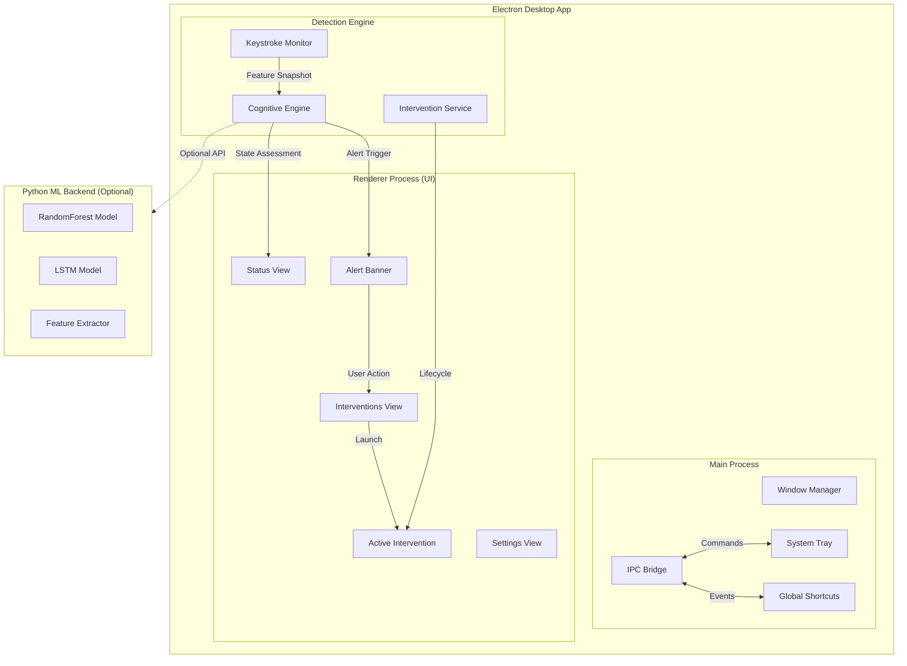
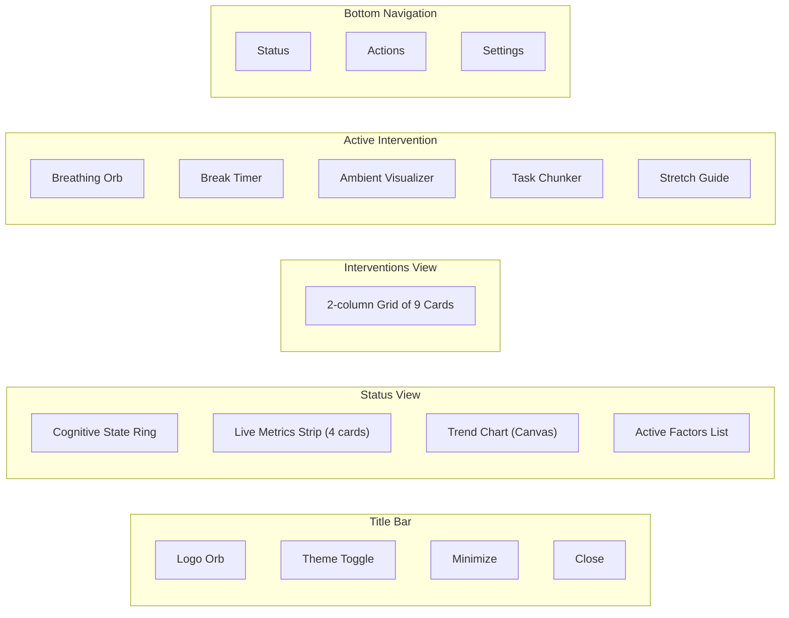

# 🧠 Zenith — Cognitive Wellness Assistant

> **Product Name:** Zenith  
> **Tagline:** *"Your mind's co-pilot."*  
> **Category:** Cognitive wellness · Productivity · Desktop companion

---

## 🏗️ System Architecture



---

## 📂 Folder Structure

```
zenith-app/
├── package.json                    # Electron project config
├── src/
│   ├── main/
│   │   └── main.js                 # Electron main process
│   ├── renderer/
│   │   ├── index.html              # App shell
│   │   ├── css/
│   │   │   ├── design-system.css   # Design tokens & base
│   │   │   ├── components.css      # Component styles
│   │   │   ├── animations.css      # Micro-animations
│   │   │   └── interventions.css   # Intervention UI styles
│   │   ├── js/
│   │   │   └── app.js              # Renderer logic
│   │   ├── components/             # Reusable UI components
│   │   └── assets/
│   │       └── sounds/             # Ambient audio files
│   ├── engine/
│   │   └── cognitive-engine.js     # Cognitive load analysis
│   └── services/
│       ├── keystroke-monitor.js    # Input capture service
│       └── intervention-service.js # Intervention management
├── assets/
│   └── icons/                      # App icons
└── node_modules/
```

---

## 🛠️ Tech Stack

| Layer | Technology | Rationale |
|-------|-----------|-----------|
| **Desktop Shell** | Electron 33 | Cross-platform, mature, rich API |
| **UI** | Vanilla HTML/CSS/JS | Zero-dependency, maximum control |
| **Typography** | Inter + JetBrains Mono | Premium, highly legible |
| **ML Backend** | Python (RandomForest + LSTM) | Existing trained models |
| **Audio** | Web Audio API | Synthetic ambient sound generation |
| **Build** | electron-builder (production) | Single .exe packaging |

---

## 🧩 Key Modules

### 1. Keystroke Monitor (`keystroke-monitor.js`)
- Captures keyboard events via DOM listeners (app-level)
- Sliding 10-second window for real-time feature extraction
- Extracts **9 features**: typing_speed, avg_pause, max_pause, min_pause, pause_variance, key_count, burst_typing, long_pause_count, pause_ratio
- Tracks error rate (backspace/delete ratio)
- Measures continuous typing duration

### 2. Cognitive Engine (`cognitive-engine.js`)
- **6-factor weighted analysis:**
  - Typing speed (20%)
  - Pause patterns (25%)
  - Error rate (20%)
  - Variance (15%)
  - Continuous typing (10%)
  - Context switching (10%)
- Exponential smoothing (α = 0.3) to prevent noise
- 4-state classification: `calm → focused → stressed → overloaded`
- Smart recommendation system with 2-minute cooldown
- Trend detection (increasing / stable / decreasing)

### 3. Intervention Service (`intervention-service.js`)
9 actionable interventions:

| ID | Name | Duration | Description |
|----|------|----------|-------------|
| `breathing` | Guided Breathing | 30s | Box breathing (4-4-4-4) with animated orb |
| `break` | Micro-Break Timer | 90s | Countdown with progress bar |
| `ambient` | Ambient Sounds | 5min | Synthesized rain/white noise/forest |
| `chunk-task` | Break It Down | — | Split task into 3 editable steps |
| `stretch` | Quick Stretch | 45s | 3 guided stretches (neck, shoulders, wrists) |
| `focus-mode` | Focus Reset | 2min | Notification blocking timer |
| `reflect` | Pause & Reflect | 20s | Random mindfulness prompt |
| `screen-dim` | Screen Dim Break | 30s | Full overlay micro-break |
| `posture` | Posture Check | 10s | Interactive checklist |

---

## 🎨 Design System

### Color Palette (Dark Theme)

| Token | Value | Usage |
|-------|-------|-------|
| `--bg-primary` | `#0a0a0f` | App background |
| `--bg-secondary` | `#12121a` | Cards, panels |
| `--bg-tertiary` | `#1a1a26` | Hover states |
| `--accent-calm` | `#63e2b8` | Calm state (teal-mint) |
| `--accent-focused` | `#4fc3f7` | Focused state (sky blue) |
| `--accent-stressed` | `#ffb74d` | Stressed state (amber) |
| `--accent-overloaded` | `#ef5350` | Overloaded state (coral red) |
| `--gradient-brand` | `#63e2b8 → #4fc3f7 → #ab7df8` | Logo, accents |

### Typography
- **Primary:** Inter (300–700) — clean, modern sans-serif
- **Monospace:** JetBrains Mono — metrics, timers, data
- **Base size:** 13px with 1.5 line-height

### Spacing Scale
`4px → 8px → 12px → 16px → 24px → 32px → 48px`

### Border Radius
`6px → 10px → 14px → 20px → 9999px (pill)`

---

## 🖥️ UI Component Breakdown



---

## 🔐 Privacy & Ethics

> [!IMPORTANT]
> - **No keystrokes stored** — only timing patterns analyzed
> - **No text content captured** — only inter-key intervals
> - **All processing local** — no data sent externally
> - **No screenshots or screen content** accessed
> - **User controls everything** — pause/resume at any time

---

## ⚡ Keyboard Shortcuts

| Shortcut | Action |
|----------|--------|
| `Ctrl + Shift + Z` | Toggle Zenith visibility |
| System tray click | Show/hide window |
| Right-click tray | Context menu |

---

## 🚀 Production-Grade Recommendations

1. **OS-level hooks:** Replace DOM events with [uiohook-napi](https://github.com/nicanderson/uiohook-napi) for system-wide monitoring
2. **Auto-updater:** Add `electron-updater` for seamless OTA updates
3. **Build pipeline:** Use `electron-builder` to produce `.exe` / `.dmg` / `.AppImage`
4. **Telemetry:** Optional, anonymized usage analytics (opt-in only)
5. **User calibration:** First-run wizard to calibrate thresholds to individual typing patterns
6. **ML model serving:** Bundle the Python LSTM model via ONNX runtime for zero-dependency inference
7. **Data persistence:** Use `electron-store` for settings, session history, intervention stats
8. **Accessibility:** Add ARIA labels, keyboard navigation, screen reader support
9. **Localization:** i18n support for multi-language deployment
10. **Installer:** Code-sign the binary, add to Windows startup via registry

---

## 🎯 Branding Direction

| Element | Direction |
|---------|-----------|
| **Name** | Zenith — peak mental clarity |
| **Logo** | Animated gradient orb (teal → blue → purple) |
| **Voice** | Calm, non-judgmental, supportive |
| **Aesthetic** | Linear/Raycast-inspired minimalism |
| **Positioning** | "Not another productivity tool — your cognitive wellness companion" |

